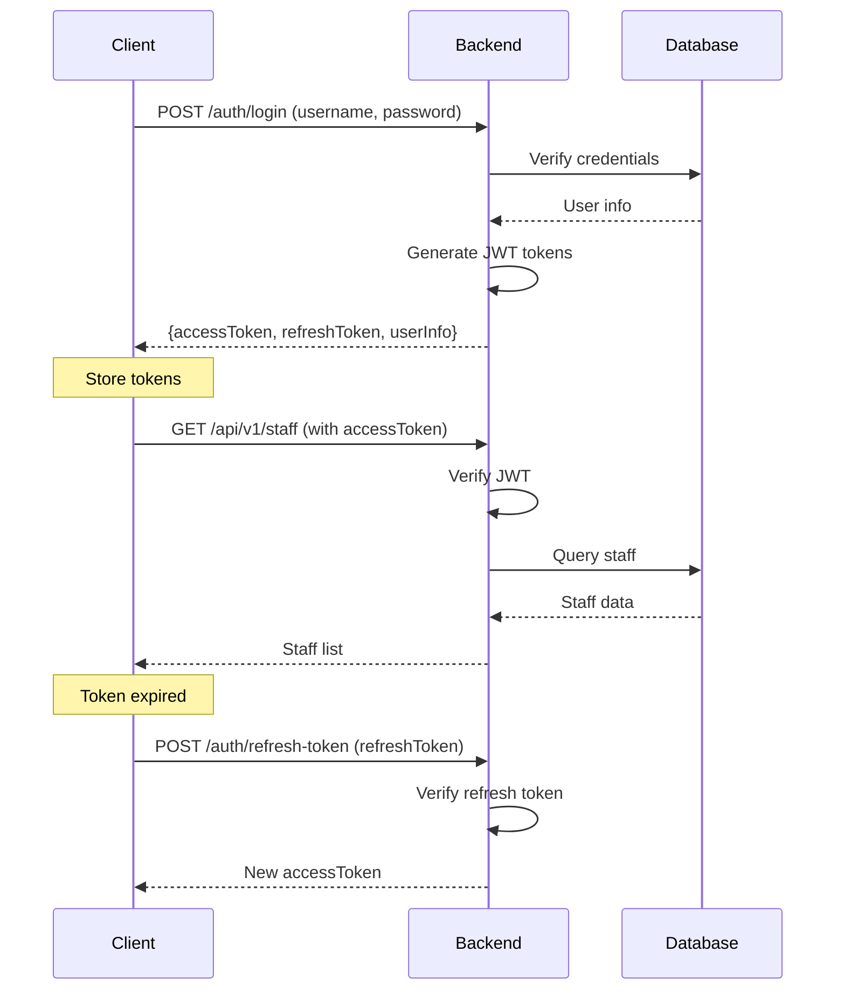
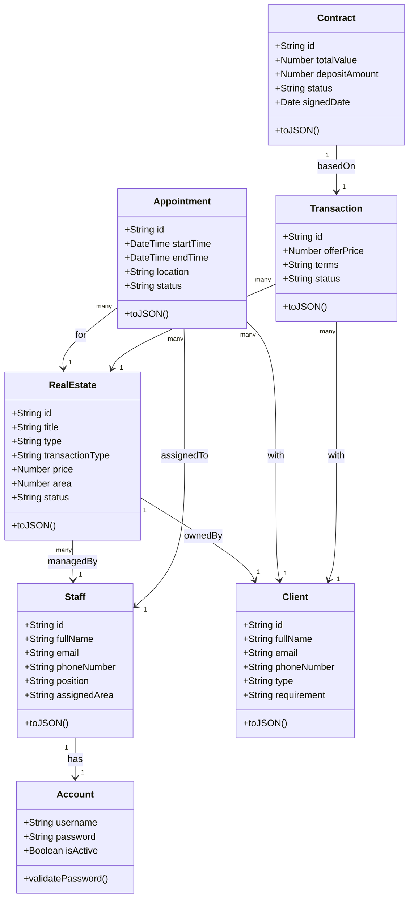
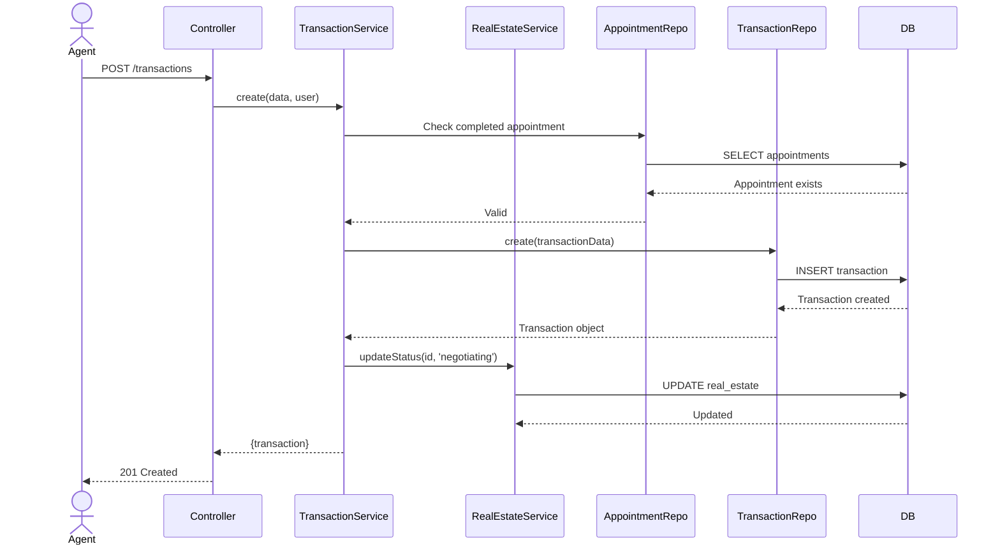

# 🏢 Hệ Thống Quản Lý Văn Phòng Bất Động Sản

## Real Estate Office Management System

[](LICENSE)
[](https://nodejs.org)
[](https://www.postgresql.org)
[](https://expressjs.com)
[](https://nextjs.org)
[](https://www.typescriptlang.org)
[](https://www.docker.com)

> **Đề tài:** Phần mềm quản lý văn phòng bất động sản  
> **Phương pháp phát triển:** Lập trình hướng đối tượng (Object-Oriented Programming)  
> **Môn học:** SE100 - Phương pháp phát triển phần mềm hướng đối tượng

---

## 📖 Giới Thiệu Dự Án

Hệ thống quản lý văn phòng bất động sản là một ứng dụng web toàn diện được xây dựng để số hóa và tối ưu hóa quy trình hoạt động của các công ty kinh doanh bất động sản. Hệ thống hỗ trợ quản lý thông tin bất động sản, khách hàng, nhân viên, lịch hẹn, giao dịch, hợp đồng và báo cáo tài chính.

### 🎯 Mục Tiêu Dự Án

- Số hóa quy trình quản lý bất động sản từ đăng tin đến hoàn tất giao dịch
- Tự động hóa quy trình làm việc giữa các phòng ban (Sale, Pháp lý, Kế toán)
- Cung cấp công cụ báo cáo và phân tích hiệu quả kinh doanh
- Áp dụng nguyên tắc lập trình hướng đối tượng trong thiết kế và triển khai

### 🏗️ Kiến Trúc Hệ Thống

Dự án sử dụng kiến trúc **3-tier** với các tầng rõ ràng:

```
┌─────────────────────────────────────────────────────────┐
│                   Frontend Layer                         │
│              Next.js 15 + TypeScript                     │
│           React, TailwindCSS, Shadcn/ui                  │
└─────────────────────────────────────────────────────────┘
                           ↕ REST API
┌─────────────────────────────────────────────────────────┐
│                   Backend Layer                          │
│               Node.js + Express.js                       │
│    Controllers → Services → Repositories → Models        │
└─────────────────────────────────────────────────────────┘
                           ↕ SQL
┌─────────────────────────────────────────────────────────┐
│                   Database Layer                         │
│               PostgreSQL 15 + Migrations                 │
└─────────────────────────────────────────────────────────┘
```

### 🔑 Tính Năng Chính

#### Theo Vai Trò Người Dùng:

**👤 Quản lý (Manager)**

- Quản lý nhân viên, phân quyền và theo dõi hiệu suất
- Xem báo cáo tổng hợp (doanh thu, hiệu suất, tình trạng BĐS)
- Quản lý cấu hình hệ thống và nhật ký hoạt động

**🏠 Nhân viên Sale (Agent)**

- Quản lý thông tin khách hàng và lịch sử tương tác
- Đăng tin, cập nhật thông tin bất động sản
- Đặt lịch hẹn xem nhà và quản lý giao dịch
- Theo dõi tiến độ từ đàm phán đến ký hợp đồng

**⚖️ Nhân viên Pháp lý (Legal Officer)**

- Kiểm tra hồ sơ pháp lý bất động sản
- Soạn thảo và quản lý hợp đồng
- Cập nhật trạng thái hợp đồng (đã ký, công chứng)

**💰 Kế toán (Accountant)**

- Ghi nhận phiếu thu, phiếu chi
- Quản lý công nợ theo hợp đồng
- Theo dõi dòng tiền và báo cáo tài chính

## 📋 Mục Lục

- [Yêu Cầu Hệ Thống](#-yêu-cầu-hệ-thống)
- [Cài Đặt và Phát Triển](#-cài-đặt-và-phát-triển)
- [Công Nghệ Sử Dụng](#-công-nghệ-sử-dụng)
- [Cấu Trúc Dự Án](#-cấu-trúc-dự-án)
- [API Documentation](#-api-documentation)
- [Triển Khai](#-triển-khai)
- [Testing](#-testing)
- [Contributing](#-contributing)

---

## 💻 Yêu Cầu Hệ Thống

Trước khi bắt đầu, hãy đảm bảo máy tính của bạn đã cài đặt:

### Phát Triển Cục Bộ (Local Development)

- **Git** - quản lý mã nguồn
- **Docker Desktop** - containerization (phải chạy trước khi thực thi lệnh)
- **Node.js** >= 18.0.0 (khuyến nghị 20.x LTS)
- **Make** (tùy chọn) - Makefile cung cấp các lệnh tiện lợi

### Công Cụ Phát Triển Khuyến Nghị

- **VS Code** với các extensions:
  - ESLint
  - Prettier
  - PostgreSQL Explorer
  - REST Client
- **Postman** hoặc **Insomnia** - test API
- **DBeaver** hoặc **pgAdmin** - quản lý database

---

## 🚀 Cài Đặt và Phát Triển

### 🚀 Khởi Động Nhanh (Quick Start)

#### Sử dụng Make (Khuyến nghị)

```bash
# Bước 1: Clone repository
git clone <repository-url>
cd real-estate-office-management

# Bước 2: Khởi tạo môi trường
make setup

# Bước 3: Cấu hình biến môi trường
# Chỉnh sửa backend/.env để thiết lập JWT secrets và Cloudinary credentials

# Bước 4: Khởi động môi trường phát triển
make dev

# Bước 5: Truy cập các dịch vụ
# - Backend API: http://localhost:8081
# - Frontend: http://localhost:3000
# - API Documentation: http://localhost:8081/api-docs
# - Database: localhost:5433
```

#### Hoặc Sử Dụng Docker Compose Trực Tiếp

```bash
# Khởi động tất cả services
docker-compose up -d

# Chỉ khởi động database và backend
docker-compose up -d db backend

# Xem logs
docker-compose logs -f backend

# Dừng tất cả services
docker-compose down
```

### 📝 Hướng Dẫn Chi Tiết

#### Bước 1: Chuẩn Bị Secrets và Credentials

**Tài khoản Cloudinary** (cho upload file/hình ảnh):

- Tạo tài khoản miễn phí tại [Cloudinary](https://cloudinary.com)
- Lấy các thông tin sau từ Dashboard:
  - `CLOUDINARY_CLOUD_NAME`
  - `CLOUDINARY_API_KEY`
  - `CLOUDINARY_API_SECRET`

**JWT Secrets** (sinh 2 chuỗi ngẫu nhiên cho tokens):

```bash
# Chạy 2 lần để tạo 2 key khác nhau
openssl rand -base64 32
```

#### Bước 2: Cấu Hình File `.env`

```bash
# Copy file mẫu
cp backend/.env.example backend/.env

# Chỉnh sửa file
nano backend/.env  # hoặc dùng editor yêu thích
```

**Các biến môi trường bắt buộc:**

```env
# JWT Configuration
JWT_SECRET=<secret-từ-openssl-ở-trên>
JWT_REFRESH_SECRET=<secret-khác-từ-openssl>
JWT_EXPIRE=7d
JWT_REFRESH_EXPIRE=30d

# Cloudinary Configuration
CLOUDINARY_CLOUD_NAME=<your-cloud-name>
CLOUDINARY_API_KEY=<your-api-key>
CLOUDINARY_API_SECRET=<your-api-secret>

# Database (tự động cấu hình trong Docker)
DB_HOST=localhost
DB_PORT=5433
DB_USER=devuser
DB_PASSWORD=devpassword
DB_NAME=se100_dev_db

# Server
PORT=8080
NODE_ENV=development
LOG_LEVEL=debug
```

#### Bước 3: Khởi Động Docker

```bash
# Khuyến nghị: sử dụng Makefile
make dev

# Hoặc dùng docker-compose trực tiếp
docker-compose up -d db backend frontend
```

#### Bước 4: Chạy Database Migrations

```bash
# Sau khi database đã khởi động
docker exec -it se100-backend npm run db:migrate

# Hoặc nếu chạy local (không dùng Docker)
cd backend && npm run db:migrate
```

#### Bước 5: Truy Cập Các Dịch Vụ

| Service         | URL                                 | Mô Tả                 |
| --------------- | ----------------------------------- | --------------------- |
| **Backend API** | http://localhost:8081               | REST API              |
| **API Docs**    | http://localhost:8081/api-docs      | Swagger UI            |
| OpenAPI JSON    | http://localhost:8081/api-docs.json | OpenAPI Specification |
| Health Check    | http://localhost:8081/health        | Trạng thái server     |
| **Frontend**    | http://localhost:3000               | Web Application       |
| Database        | localhost:5433                      | PostgreSQL            |
| Adminer         | http://localhost:8080               | Database GUI          |

### 🛠️ Các Lệnh Hữu Ích

```bash
# Xem danh sách lệnh Make có sẵn
make help

# Khởi động development environment
make dev

# Dừng tất cả containers
make down

# Xem logs real-time
make logs

# Rebuild và restart containers
make restart

# Reset database (xóa dữ liệu và khởi tạo lại)
make db-reset

# Chạy migrations
make db-migrate

# Chạy tests
make test

# Chạy linter
make lint
```

---

## 🏗️ Công Nghệ Sử Dụng

### Backend Stack

| Công Nghệ      | Phiên Bản | Mục Đích            |
| -------------- | --------- | ------------------- |
| **Node.js**    | >= 18.0.0 | JavaScript runtime  |
| **Express.js** | 5.1.0     | Web framework       |
| **PostgreSQL** | 15        | Relational database |
| **JWT**        | 9.0.2     | Authentication      |
| **Cloudinary** | 1.41.3    | File/Image storage  |
| **Joi**        | 18.0.2    | Validation          |
| **Winston**    | 3.11.0    | Logging             |
| **Swagger**    | -         | API Documentation   |
| **Jest**       | 29.7.0    | Testing framework   |
| **ESLint**     | 9.39.0    | Code linting        |

### Frontend Stack

| Công Nghệ           | Phiên Bản | Mục Đích              |
| ------------------- | --------- | --------------------- |
| **Next.js**         | 15.5.9    | React framework       |
| **TypeScript**      | 5.x       | Type safety           |
| **React**           | 18.3.1    | UI library            |
| **TailwindCSS**     | 4.1.14    | Styling               |
| **Shadcn/ui**       | -         | Component library     |
| **Radix UI**        | -         | Accessible components |
| **React Hook Form** | 7.64.0    | Form handling         |
| **Zod**             | 4.1.12    | Schema validation     |
| **Zustand**         | 5.0.8     | State management      |
| **Recharts**        | 3.6.0     | Data visualization    |

### DevOps & Tools

- **Docker** & **Docker Compose** - Containerization
- **Render.com** - Cloud deployment
- **GitHub Actions** - CI/CD (future)
- **Prettier** - Code formatting
- **Nodemon** - Development hot-reload

---

## 📁 Cấu Trúc Dự Án

### Tổng Quan

```
real-estate-office-management/
├── backend/               # Node.js Express API
├── frontend/              # Next.js Web App
├── docs/                  # Tài liệu thiết kế
├── docker-compose.yml     # Docker orchestration
├── Makefile              # Convenience commands
├── render.yaml           # Cloud deployment config
└── README.md             # Tài liệu này
```

### Backend Structure (Layered Architecture)

```
backend/
├── src/
│   ├── app.js                    # Express app setup
│   ├── index.js                  # Entry point
│   │
│   ├── config/                   # Configuration
│   │   ├── database.js           # PostgreSQL connection
│   │   ├── constants.js          # Business constants
│   │   ├── environment.js        # Environment variables
│   │   ├── cloudinary.js         # File storage config
│   │   └── swagger.js            # API documentation
│   │
│   ├── models/                   # Domain Models (OOP)
│   │   ├── account.model.js      # Account entity
│   │   ├── staff.model.js        # Staff entity
│   │   ├── client.model.js       # Client entity
│   │   ├── real-estate.model.js  # RealEstate entity
│   │   ├── appointment.model.js  # Appointment entity
│   │   ├── transaction.model.js  # Transaction entity
│   │   ├── contract.model.js     # Contract entity
│   │   └── ...                   # Other entities
│   │
│   ├── repositories/             # Data Access Layer
│   │   ├── account.repository.js
│   │   ├── staff.repository.js
│   │   ├── client.repository.js
│   │   └── ...                   # CRUD operations
│   │
│   ├── services/                 # Business Logic Layer
│   │   ├── auth.service.js       # Authentication logic
│   │   ├── staff.service.js      # Staff management
│   │   ├── real-estate.service.js# Property management
│   │   ├── appointment.service.js# Scheduling logic
│   │   ├── transaction.service.js# Transaction handling
│   │   ├── contract.service.js   # Contract management
│   │   └── ...                   # Business rules
│   │
│   ├── controllers/              # Request Handlers
│   │   ├── auth.controller.js    # Auth endpoints
│   │   ├── staff.controller.js   # Staff endpoints
│   │   ├── real-estate.controller.js
│   │   └── ...                   # HTTP request/response
│   │
│   ├── routes/                   # API Routes
│   │   ├── auth.routes.js
│   │   ├── staff.routes.js
│   │   └── ...                   # Route definitions
│   │
│   ├── middlewares/              # Express Middlewares
│   │   ├── auth.middleware.js    # JWT verification
│   │   ├── validate.middleware.js# Request validation
│   │   ├── error.middleware.js   # Error handling
│   │   └── upload.middleware.js  # File upload
│   │
│   ├── validators/               # Input Validation Schemas
│   │   ├── auth.validator.js
│   │   ├── staff.validator.js
│   │   └── ...                   # Joi schemas
│   │
│   ├── utils/                    # Utilities
│   │   ├── logger.js             # Winston logger
│   │   ├── password.js           # Password hashing
│   │   └── ...                   # Helper functions
│   │
│   └── __tests__/                # Test suites
│       ├── unit/                 # Unit tests
│       ├── integration/          # Integration tests
│       └── setup.js              # Test configuration
│
├── migrations/                   # Database migrations
│   ├── 001_add_login_session.sql
│   ├── 002_update_passwords.sql
│   └── ...                       # SQL migration files
│
├── scripts/
│   └── run-migrations.js         # Migration runner
│
├── Dockerfile                    # Docker image build
├── package.json                  # Dependencies
├── jest.config.js                # Test configuration
└── eslint.config.js              # Linting rules
```

### Frontend Structure

```
frontend/
├── src/
│   ├── app/                      # Next.js App Router
│   │   ├── (auth)/               # Auth routes
│   │   ├── (dashboard)/          # Protected routes
│   │   ├── layout.tsx            # Root layout
│   │   └── page.tsx              # Home page
│   │
│   ├── components/               # React Components
│   │   ├── ui/                   # Shadcn/ui components
│   │   ├── forms/                # Form components
│   │   ├── layouts/              # Layout components
│   │   └── ...                   # Reusable components
│   │
│   ├── lib/                      # Utilities
│   │   ├── api.ts                # API client
│   │   ├── utils.ts              # Helper functions
│   │   └── validations.ts        # Zod schemas
│   │
│   ├── hooks/                    # Custom React hooks
│   │   ├── useAuth.ts
│   │   ├── useApi.ts
│   │   └── ...
│   │
│   └── global.d.ts               # TypeScript types
│
├── public/                       # Static assets
├── next.config.ts                # Next.js config
├── tailwind.config.ts            # TailwindCSS config
├── tsconfig.json                 # TypeScript config
└── package.json                  # Dependencies
```

---

## 📚 API Documentation

### Swagger UI

API documentation được tự động sinh bằng Swagger và có thể truy cập tại:

**🔗 http://localhost:8081/api-docs**

### Các Module API Chính

#### 1. Authentication (`/api/v1/auth`)

- `POST /auth/login` - Đăng nhập
- `POST /auth/logout` - Đăng xuất
- `POST /auth/refresh-token` - Làm mới token
- `GET /auth/me` - Lấy thông tin user hiện tại

#### 2. Staff Management (`/api/v1/staff`)

- `POST /staff` - Tạo nhân viên mới (Manager)
- `GET /staff` - Danh sách nhân viên
- `GET /staff/:id` - Chi tiết nhân viên
- `PUT /staff/:id` - Cập nhật thông tin
- `PATCH /staff/:id/status` - Kích hoạt/Vô hiệu hóa

#### 3. Client Management (`/api/v1/clients`)

- `POST /clients` - Thêm khách hàng
- `GET /clients` - Danh sách khách hàng
- `GET /clients/:id` - Chi tiết khách hàng
- `PUT /clients/:id` - Cập nhật thông tin
- `POST /clients/:id/notes` - Thêm ghi chú tương tác
- `GET /clients/:id/notes` - Lịch sử tương tác

#### 4. Real Estate (`/api/v1/real-estates`)

- `POST /real-estates` - Đăng tin BĐS
- `GET /real-estates` - Danh sách BĐS
- `GET /real-estates/:id` - Chi tiết BĐS
- `PUT /real-estates/:id` - Cập nhật thông tin
- `PUT /real-estates/:id/legal-check` - Kiểm tra pháp lý (Legal Officer)
- `PATCH /real-estates/:id/status` - Cập nhật trạng thái

#### 5. Appointments (`/api/v1/appointments`)

- `POST /appointments` - Đặt lịch hẹn
- `GET /appointments` - Danh sách lịch hẹn
- `GET /appointments/:id` - Chi tiết lịch hẹn
- `PATCH /appointments/:id/status` - Cập nhật trạng thái

#### 6. Transactions (`/api/v1/transactions`)

- `POST /transactions` - Tạo giao dịch
- `GET /transactions` - Danh sách giao dịch
- `PUT /transactions/:id` - Cập nhật đàm phán
- `PUT /transactions/:id/finalize` - Hoàn tất đàm phán
- `PUT /transactions/:id/cancel` - Hủy giao dịch

#### 7. Contracts (`/api/v1/contracts`)

- `POST /contracts` - Tạo hợp đồng (Legal Officer)
- `GET /contracts` - Danh sách hợp đồng
- `GET /contracts/:id` - Chi tiết hợp đồng
- `PATCH /contracts/:id/status` - Cập nhật trạng thái
- `POST /contracts/:id/files` - Upload file đính kèm

#### 8. Vouchers (`/api/v1/vouchers`)

- `POST /vouchers` - Tạo phiếu thu/chi (Accountant)
- `GET /vouchers` - Danh sách phiếu
- `GET /vouchers/:id` - Chi tiết phiếu

#### 9. Reports (`/api/v1/reports`)

- `GET /reports/revenue` - Báo cáo doanh thu
- `GET /reports/performance` - Hiệu suất nhân viên
- `GET /reports/real-estate-status` - Tình trạng BĐS
- `GET /reports/financial` - Báo cáo tài chính

#### 10. System (`/api/v1/system`)

- `GET /system/config` - Cấu hình hệ thống
- `PUT /system/config` - Cập nhật cấu hình
- `GET /system/logs` - Nhật ký hoạt động

### Authentication Flow



---

## 🎨 Thiết Kế Hướng Đối Tượng (OOP)

### Nguyên Tắc Áp Dụng

Dự án này áp dụng các nguyên tắc OOP cơ bản và mô hình thiết kế phần mềm hiện đại:

#### 1. **Encapsulation (Đóng gói)**

- Mỗi Model class đóng gói dữ liệu và hành vi liên quan
- Private properties và public methods
- Data validation trong constructor

```javascript
// backend/src/models/real-estate.model.js
class RealEstate {
  constructor(data) {
    this.id = data.id;
    this.title = data.title;
    this.type = data.type;
    this.transaction_type = data.transaction_type;
    this.location = data.location;
    this.price = data.price;
    // ... encapsulated properties
  }

  toJSON() {
    return {
      id: this.id,
      title: this.title,
      // ... serialize data
    };
  }
}
```

#### 2. **Abstraction (Trừu tượng hóa)**

- Services trừu tượng hóa business logic
- Repositories trừu tượng hóa data access
- Controllers chỉ xử lý HTTP logic

```
Client Request → Controller → Service → Repository → Database
                     ↓           ↓           ↓
                  HTTP Logic  Business   Data Access
```

#### 3. **Separation of Concerns (Tách biệt nhiệm vụ)**

```javascript
// Controller: Xử lý HTTP request/response
class RealEstateController {
  async create(req, res, next) {
    const result = await realEstateService.create(req.body, req.user);
    res.status(201).json(result);
  }
}

// Service: Business logic
class RealEstateService {
  async create(data, user) {
    // Validate ownership
    // Process files
    // Apply business rules
    return await realEstateRepository.create(data);
  }
}

// Repository: Database operations
class RealEstateRepository {
  async create(data) {
    const result = await db.query("INSERT INTO ...");
    return new RealEstate(result.rows[0]);
  }
}
```

#### 4. **Single Responsibility Principle (SRP)**

- Mỗi class có một trách nhiệm duy nhất:
  - **Models**: Định nghĩa cấu trúc dữ liệu
  - **Repositories**: CRUD operations
  - **Services**: Business logic
  - **Controllers**: HTTP handling
  - **Validators**: Input validation
  - **Middlewares**: Cross-cutting concerns

#### 5. **Dependency Injection**

```javascript
// Service phụ thuộc vào Repository (injected)
class RealEstateService {
  constructor(realEstateRepo, clientRepo, fileService) {
    this.realEstateRepo = realEstateRepo;
    this.clientRepo = clientRepo;
    this.fileService = fileService;
  }

  async create(data) {
    // Use injected dependencies
    const client = await this.clientRepo.findById(data.owner_id);
    // ...
  }
}
```

### Class Diagram (Core Entities)



### Workflow Example: Tạo Giao Dịch



---

## 🗄️ Database Schema

# Development

make dev # Run backend + db (hot-reload)
make up # Run in background
make down # Stop services
make logs # Tail backend logs

# Database

make db-reset # Reset the database (wipe data and re-init)
make db-shell # Open PostgreSQL shell
make db-gui # Start Adminer (DB web GUI)

# Quality

make test # Run backend tests
make lint # Run ESLint
make format # Format code with Prettier

````

## API Documentation

After the backend is running, visit **Swagger UI**:

👉 **http://localhost:8081/api-docs**

### API Modules

| Module       | Prefix                 | Description                       |
| ------------ | ---------------------- | --------------------------------- |
| Auth         | `/api/v1/auth`         | Login, register, password reset   |
| Staff        | `/api/v1/staff`        | Staff management                  |
| Clients      | `/api/v1/clients`      | Client management                 |
| Real Estates | `/api/v1/real-estates` | Real estate listings & management |
| Appointments | `/api/v1/appointments` | Viewing appointments              |
| Transactions | `/api/v1/transactions` | Transactions & negotiations       |
| Contracts    | `/api/v1/contracts`    | Contract management               |
| Vouchers     | `/api/v1/vouchers`     | Payment vouchers                  |
| Reports      | `/api/v1/reports`      | Reporting & analytics             |
| System       | `/api/v1/system`       | System configuration              |

### Roles & Permissions

> **Architecture**: Layered architecture, Service → Repository pattern

| Role            | Description                                     |
| --------------- | ----------------------------------------------- |
| `manager`       | Manage staff, view reports, audit logs          |
| `agent`         | Manage properties, clients, appointments, deals |
| `legal_officer` | Legal checks and contract handling              |
| `accountant`    | Manage vouchers and payments                    |

### Test Accounts (Development)

| Username    | Password    | Role          |
| ----------- | ----------- | ------------- |
| manager1    | password123 | manager       |
| agent1      | password123 | agent         |
| legal1      | password123 | legal_officer |
| accountant1 | password123 | accountant    |

Notes:

- `--build` is required only the first time or when Dockerfiles change.
- `-d` runs containers in detached mode.

### Local Access After Containers Start

It may take 1–2 minutes for containers to initialize on first run. Available services:

- **Frontend (Next.js)**: http://localhost:3000
- **Backend (Node.js)**: http://localhost:8081
- **Database (Postgres)**: localhost:5433 (connect with DataGrip/DBeaver if needed)

### Docker Useful Commands

**Start (create or recreate containers)**:

```bash
docker compose up -d
````

**Tail backend logs**:

```bash
docker compose logs -f backend
```

**Stop and remove containers**:

```bash
docker compose down
```

## 3. Workflow

\*\*---

## 🗄️ Database Schema

Hệ thống sử dụng PostgreSQL với schema được thiết kế chuẩn hóa, hỗ trợ đầy đủ các nghiệp vụ quản lý bất động sản.

### Các Bảng Chính

```
┌─────────────────┐
│    account      │ 1 ──── 1 │    staff        │
└─────────────────┘          └─────────────────┘
                                     │ 1
                                     │
                                     │ manages
                                     │
                                     │ *
                             ┌───────────────┐
                             │    client     │
                             └───────────────┘
                                     │ owns
                                     │ 1
                                     │
                                     │ *
                             ┌───────────────┐
                             │ real_estate   │
                             └───────────────┘
                                     │ 1
                                     │
                  ┌──────────────────┼──────────────────┐
                  │ *                │ *                │ *
          ┌───────────────┐  ┌───────────────┐ ┌──────────────┐
          │ appointment   │  │ transaction   │ │ price_history│
          └───────────────┘  └───────────────┘ └──────────────┘
                                     │ 1
                                     │
                                     │ *
                             ┌───────────────┐
                             │   contract    │
                             └───────────────┘
                                     │ 1
                                     │
                                     │ *
                             ┌───────────────┐
                             │   voucher     │
                             └───────────────┘
```

### Core Tables

#### 1. **account** - Tài khoản đăng nhập

```sql
- id (BIGSERIAL, PK)
- username (VARCHAR, UNIQUE)
- password (VARCHAR, hashed)
- is_active (BOOLEAN)
- created_at, updated_at (TIMESTAMP)
```

#### 2. **staff** - Nhân viên

```sql
- id (BIGSERIAL, PK)
- account_id (BIGINT, FK -> account.id)
- full_name, email, phone_number
- position (ENUM: admin, manager, agent, legal_officer, accountant)
- assigned_area (VARCHAR)
- status (ENUM: working, off_duty)
- preferences (JSONB)
```

#### 3. **client** - Khách hàng

```sql
- id (BIGSERIAL, PK)
- full_name, email, phone_number, address
- type (ENUM: buyer, seller, landlord, tenant)
- referral_src, requirement (TEXT)
- staff_id (BIGINT, FK -> staff.id)
```

#### 4. **real_estate** - Bất động sản

```sql
- id (BIGSERIAL, PK)
- title, type (VARCHAR)
- transaction_type (ENUM: sale, rent)
- location, price, area
- description (TEXT)
- direction (ENUM: north, south, east, west, ...)
- media_files (BIGINT[]) - array of file IDs
- legal_docs (BIGINT[])
- owner_id (BIGINT, FK -> client.id)
- staff_id (BIGINT, FK -> staff.id)
- status (ENUM: created, pending_legal_check, listed, negotiating, transacted, suspended)
```

#### 5. **appointment** - Lịch hẹn

```sql
- id (BIGSERIAL, PK)
- real_estate_id (BIGINT, FK)
- client_id (BIGINT, FK)
- staff_id (BIGINT, FK)
- start_time, end_time (TIMESTAMP)
- location, note (TEXT)
- status (ENUM: created, confirmed, completed, cancelled)
```

#### 6. **transaction** - Giao dịch

```sql
- id (BIGSERIAL, PK)
- real_estate_id (BIGINT, FK)
- client_id (BIGINT, FK)
- staff_id (BIGINT, FK)
- offer_price (NUMERIC)
- terms (TEXT)
- status (ENUM: negotiating, pending_contract, cancelled)
- cancellation_reason (TEXT)
```

#### 7. **contract** - Hợp đồng

```sql
- id (BIGSERIAL, PK)
- transaction_id (BIGINT, FK)
- type (VARCHAR)
- party_a_id, party_b_id (BIGINT, FK -> client.id)
- total_value, deposit_amount (NUMERIC)
- payment_terms (TEXT)
- remaining_amount (NUMERIC)
- signed_date, effective_date, expiration_date (DATE)
- attachments (BIGINT[])
- status (ENUM: draft, pending_signature, signed, notarized, finalized, cancelled)
- staff_id (BIGINT, FK -> staff.id) - Legal Officer
```

#### 8. **voucher** - Phiếu thu/chi

```sql
- id (BIGSERIAL, PK)
- contract_id (BIGINT, FK, nullable)
- type (ENUM: receipt, payment)
- party (VARCHAR)
- payment_time (TIMESTAMP)
- amount (NUMERIC)
- payment_method (ENUM: cash, bank_transfer)
- payment_description (TEXT)
- attachments (BIGINT[])
- staff_id (BIGINT, FK) - Accountant
```

### Migrations

Database migrations được quản lý bằng SQL scripts trong thư mục `backend/migrations/`:

- `001_add_login_session.sql` - Session management
- `002_update_passwords.sql` - Password hashing
- `003_add_system_config_table.sql` - System configuration
- `004_add_config_catalog_table.sql` - Config catalog
- `005_add_role_permission_table.sql` - RBAC
- `006_update_staff_table.sql` - Staff preferences
- `007_add_admin_position.sql` - Admin role
- `008_add_account_updated_at.sql` - Timestamp tracking

Chạy migrations:

```bash
npm run db:migrate
```

---

## 🚢 Triển Khai (Deployment)

### Môi Trường Cloud

#### Staging Environment

- **Frontend**: https://real-estate-office-management-stag.vercel.app/
- **Backend**: https://real-estate-office-management-stag.onrender.com/
- **Mục đích**: Tự động deploy từ branch `develop` cho team testing

#### Production Environment (Demo)

- **Frontend**: https://real-estate-office-management-prod.vercel.app/
- **Backend**: https://real-estate-office-management-prod.onrender.com/
- **Mục đích**: Deploy từ branch `main`, dùng cho demo với giảng viên

### Deploy lên Render.com

Dự án được cấu hình sẵn để deploy lên **Render.com** thông qua file [render.yaml](render.yaml).

#### Các Service

1. **Backend API** (`se100-backend-api`)

   - Type: Web Service
   - Region: Singapore (gần Việt Nam nhất)
   - Plan: Starter ($7/month - always on)
   - Build: `npm ci --production`
   - Start: `npm start`
   - Auto-deploy từ branch `main`

2. **PostgreSQL Database** (`se100-postgres`)

   - Type: PostgreSQL
   - Plan: Free tier / Starter
   - Auto-backup enabled

3. **Frontend** (Deploy trên Vercel)
   - Build: `npm run build`
   - Output: `.next` static files
   - Environment: `NEXT_PUBLIC_API_URL`

#### Environment Variables (Production)

```yaml
# Backend Service
NODE_ENV: production
PORT: 8080
API_PREFIX: /api/v1
LOG_LEVEL: info

# Database (auto-injected từ Render PostgreSQL)
DATABASE_URL: <from-render-postgres>
DB_SSL: true

# JWT Secrets (generate new cho production)
JWT_SECRET: <generate-new>
JWT_REFRESH_SECRET: <generate-new>
JWT_EXPIRE: 7d
JWT_REFRESH_EXPIRE: 30d

# Cloudinary
CLOUDINARY_CLOUD_NAME: <your-cloud>
CLOUDINARY_API_KEY: <your-key>
CLOUDINARY_API_SECRET: <your-secret>
```

#### Deployment Steps

1. **Push code lên GitHub**

```bash
git add .
git commit -m "Ready for deployment"
git push origin main
```

2. **Kết nối Render với GitHub repository**

   - Đăng nhập vào [Render.com](https://render.com)
   - New → Blueprint
   - Connect GitHub repo
   - Render sẽ tự động đọc `render.yaml`

3. **Cấu hình Environment Variables**

   - Thêm JWT secrets và Cloudinary credentials
   - Database URL được tự động inject

4. **Deploy**
   - Render tự động build và deploy
   - Theo dõi logs trong dashboard

---

## 🧪 Testing

### Backend Testing

Framework: **Jest** + **Supertest**

```bash
# Chạy tất cả tests
npm test

# Watch mode (phát triển)
npm run test:watch

# Coverage report
npm test -- --coverage
```

### Test Structure

```
backend/src/__tests__/
├── unit/                    # Unit tests
│   ├── models/
│   ├── services/
│   └── utils/
├── integration/             # Integration tests
│   ├── auth.test.js
│   ├── staff.test.js
│   └── real-estate.test.js
├── helpers/                 # Test utilities
└── setup.js                 # Test configuration
```

### Test Coverage

Mục tiêu: >= 80% coverage cho:

- Models
- Services
- Repositories
- Controllers

---

## 🔄 Workflow & Git Strategy

### Branch Strategy

```
main (production)
  ↑
develop (staging)
  ↑
feature/your-feature-name
```

**⚠️ QUAN TRỌNG: KHÔNG push trực tiếp lên `main` hoặc `develop`**

### Quy Trình Làm Việc

1. **Bắt đầu từ `develop`**:

```bash
git checkout develop
git pull origin develop
```

2. **Tạo feature branch**: Sử dụng định dạng `feature/<feature-name>`

```bash
git checkout -b feature/your-feature-name
# Ví dụ: feature/be-login-api, feature/fe-dashboard-ui
```

3. **Code & Commit** trên feature branch:

```bash
git add .
git commit -m "feat: Add login API endpoint"
git push -u origin feature/your-feature-name
```

4. **Tạo Pull Request (PR)**:

   - Mở PR từ feature branch → `develop` trên GitHub
   - Mô tả rõ thay đổi và checklist
   - Assign reviewers

5. **Review & Merge**:

   - Team members review code
   - Sau khi approve, leader/maintainer merge PR
   - Feature branch sẽ tự động deploy lên Staging

6. **Deploy Production**:
   - Chỉ leader merge từ `develop` → `main`
   - Tự động deploy lên Production environment

---

## 🤝 Contributing

### Coding Standards

#### Backend (JavaScript)

- **ESLint** configuration: `backend/eslint.config.js`
- **Prettier** formatting
- Naming conventions:
  - Files: `kebab-case.js`
  - Classes: `PascalCase`
  - Functions/variables: `camelCase`
  - Constants: `UPPER_SNAKE_CASE`

```bash
# Lint code
npm run lint

# Auto-fix issues
npm run lint:fix

# Format code
npm run format
```

#### Frontend (TypeScript)

- **TypeScript** strict mode
- **ESLint** + **Prettier**
- **TailwindCSS** class order
- Component naming: `PascalCase.tsx`

```bash
# Type checking
npm run typecheck

# Lint
npm run lint

# Format
npm run format
```

### Commit Message Convention

```
<type>: <subject>

<body>

<footer>
```

Types:

- `feat`: Tính năng mới
- `fix`: Sửa lỗi
- `docs`: Cập nhật tài liệu
- `style`: Format code (không ảnh hưởng logic)
- `refactor`: Tái cấu trúc code
- `test`: Thêm/sửa tests
- `chore`: Cập nhật build, dependencies

Example:

```
feat: Add export to Excel for report module

- Implement ExcelJS integration
- Add new endpoint /reports/export
- Update report controller with export logic

Closes #123
```

---

## 📝 License

This project is licensed under the **ISC License** - see the [LICENSE](LICENSE) file for details.

---

## 👥 Team

**SE100 - Phần Mềm Hướng Đối Tượng**

- Đề tài: Hệ thống quản lý văn phòng bất động sản
- Phương pháp: Lập trình hướng đối tượng (OOP)
- Stack: Node.js, Express, PostgreSQL, Next.js, TypeScript

---

## 📞 Support

Nếu bạn gặp vấn đề hoặc có câu hỏi:

1. **Kiểm tra tài liệu**:

   - [README.md](README.md) (file này)
   - [docs/context_design.md](docs/context_design.md) - Thiết kế hệ thống
   - [docs/build-and-deploy.md](docs/build-and-deploy.md) - Hướng dẫn triển khai
   - [API Documentation](http://localhost:8081/api-docs) - Swagger UI

2. **Common Issues**:

   - Database connection errors → Kiểm tra Docker đang chạy
   - JWT errors → Kiểm tra `.env` có JWT secrets
   - File upload errors → Kiểm tra Cloudinary credentials
   - Port conflicts → Thay đổi ports trong `docker-compose.yml`

3. **Debug Commands**:

```bash
# Kiểm tra containers
docker ps

# Xem logs
docker-compose logs -f backend

# Restart services
make restart

# Reset database
make db-reset
```

---

## 🔗 Links

- **API Documentation (Local)**: http://localhost:8081/api-docs
- **Production API**: https://real-estate-office-management-prod.onrender.com
- **Staging API**: https://real-estate-office-management-stag.onrender.com
- **Cloudinary**: https://cloudinary.com
- **Render.com**: https://render.com

---

**🎉 Happy Coding!**
