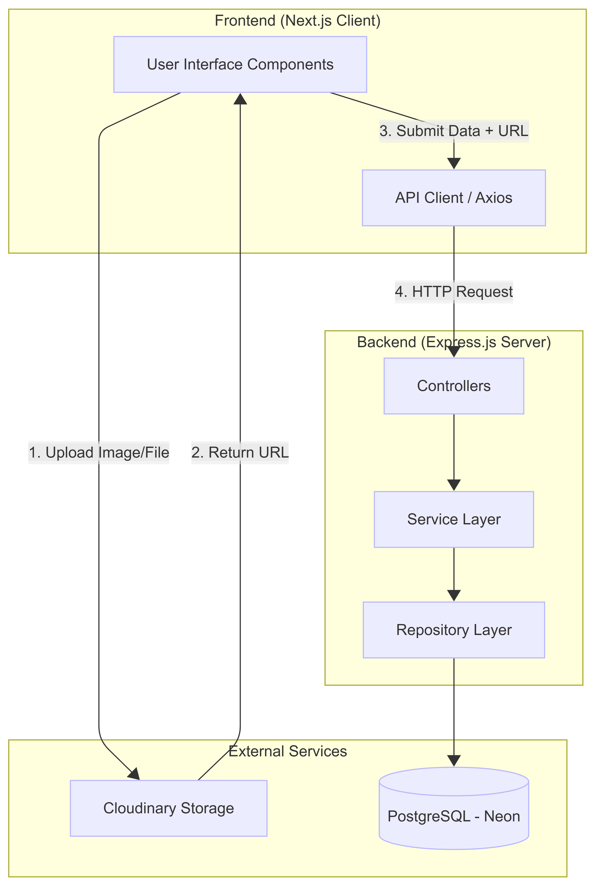

# Component & Deployment 

---

## Component Diagram

- Shows the project components and their responsibilities: **Frontend** (Next.js, hosted on Vercel), **Backend** (Node.js/Express, hosted on Render or run in containers), **Cloudinary** (media storage), and **Neon** (managed PostgreSQL for persistence).
- Interaction summary: Browser ↔ Frontend (UI), Frontend → Cloudinary (asset uploads), Frontend → Backend (API calls), Backend → Neon (data persistence).

---

## Deployment Diagram

- Illustrates the runtime deployment topology: users access Frontend (Vercel), Frontend communicates with Backend (Render or container), media assets are stored in Cloudinary, and the Backend persists data to Neon (Postgres).
- Network flows shown: client requests to Frontend, API calls from Frontend to Backend, Backend → Neon for persistence, and direct uploads from Frontend to Cloudinary for media.