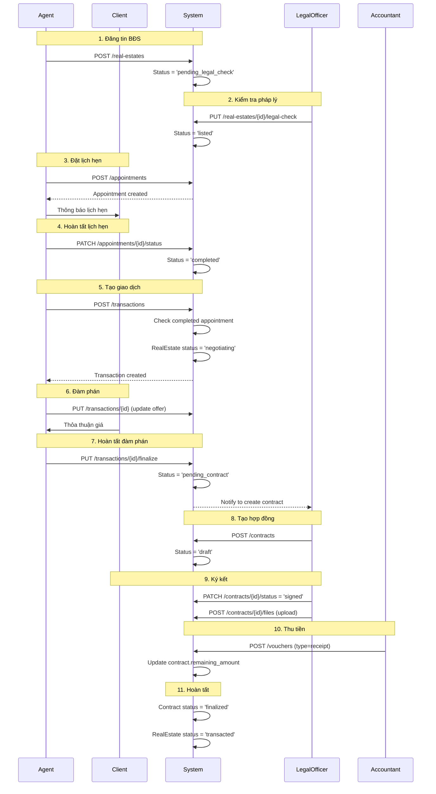

# THIẾT KẾ HỆ THỐNG: QUẢN LÝ VĂN PHÒNG BẤT ĐỘNG SẢN

## REAL ESTATE OFFICE MANAGEMENT SYSTEM

> **Tài liệu này**: Single Source of Truth cho thiết kế hệ thống, Data Structures, và API Contracts (OpenAPI/Swagger).  
> **Phương pháp**: Lập trình hướng đối tượng (Object-Oriented Programming)  
> **Môn học**: SE100 - Phần mềm hướng đối tượng

---

## MỤC LỤC

- [I. TỔNG QUAN HỆ THỐNG](#i-tổng-quan-hệ-thống)
- [II. KIẾN TRÚC HƯỚNG ĐỐI TƯỢNG](#ii-kiến-trúc-hướng-đối-tượng)
- [III. CẤU TRÚC DỮ LIỆU (DATA STRUCTURES)](#iii-cấu-trúc-dữ-liệu-data-structures)
- [IV. BUSINESS LOGIC & API SPECIFICATIONS](#iv-business-logic--api-specifications)
- [V. USE CASES & WORKFLOWS](#v-use-cases--workflows)

---

## I. TỔNG QUAN HỆ THỐNG

### 1.1 Mục Tiêu Dự Án

Xây dựng hệ thống quản lý văn phòng bất động sản số hóa toàn bộ quy trình từ đăng tin, quản lý khách hàng, đặt lịch hẹn, đàm phán, ký hợp đồng đến thanh toán và báo cáo.

### 1.2 Phạm Vi Chức Năng

#### Quản lý Nhân viên (Staff Management)

- Tạo, cập nhật thông tin nhân viên
- Phân quyền theo vai trò: Manager, Agent, Legal Officer, Accountant
- Theo dõi hiệu suất làm việc

#### Quản lý Khách hàng (Client Management)

- Quản lý database khách hàng (Buyer, Seller, Landlord, Tenant)
- Lịch sử tương tác và ghi chú
- Phân công khách hàng cho Agent

#### Quản lý Bất động sản (Real Estate Management)

- Đăng tin bất động sản (mua/bán/cho thuê)
- Upload hình ảnh, tài liệu pháp lý
- Kiểm tra pháp lý bởi Legal Officer
- Theo dõi trạng thái từ đăng tin đến giao dịch

#### Quản lý Lịch hẹn (Appointment Management)

- Đặt lịch xem nhà
- Kiểm tra conflict trong lịch Agent
- Cập nhật trạng thái và kết quả

#### Quản lý Giao dịch (Transaction Management)

- Tạo giao dịch từ lịch hẹn đã hoàn tất
- Đàm phán giá, điều khoản
- Chuyển sang hợp đồng

#### Quản lý Hợp đồng (Contract Management)

- Soạn thảo hợp đồng bởi Legal Officer
- Theo dõi trạng thái ký kết, công chứng
- Quản lý tài liệu đính kèm

#### Quản lý Tài chính (Financial Management)

- Ghi nhận phiếu thu/chi
- Theo dõi công nợ
- Báo cáo doanh thu, chi phí

#### Báo cáo & Thống kê (Reporting)

- Báo cáo doanh thu theo thời gian
- Hiệu suất Agent
- Tình trạng BĐS
- Báo cáo tài chính

### 1.3 Các Vai Trò (Actors)

| Vai trò           | Quyền hạn chính                                                            |
| ----------------- | -------------------------------------------------------------------------- |
| **Manager**       | Quản lý nhân viên, xem tất cả dữ liệu, báo cáo tổng hợp, cấu hình hệ thống |
| **Agent**         | Quản lý khách hàng, BĐS, lịch hẹn, giao dịch được phân công                |
| **Legal Officer** | Kiểm tra pháp lý BĐS, soạn thảo và quản lý hợp đồng                        |
| **Accountant**    | Ghi nhận phiếu thu/chi, quản lý công nợ, báo cáo tài chính                 |

---

## II. KIẾN TRÚC HƯỚNG ĐỐI TƯỢNG

### 2.1 Nguyên Tắc OOP Áp Dụng

#### **1. Encapsulation (Đóng gói)**

Mỗi class đóng gói dữ liệu (properties) và hành vi (methods) liên quan:

```javascript
// Model: Đóng gói dữ liệu và logic validation
class RealEstate {
  constructor(data) {
    // Private-like properties
    this.id = data.id;
    this.title = data.title;
    this.price = data.price;
    this.status = data.status || "created";
    // ... other properties
  }

  // Public method để expose dữ liệu
  toJSON() {
    return {
      id: this.id,
      title: this.title,
      price: this.price,
      status: this.status,
    };
  }

  // Business logic method
  canBeTransacted() {
    return this.status === "listed";
  }
}
```

#### **2. Abstraction (Trừu tượng hóa)**

Ẩn đi chi tiết triển khai, chỉ expose interface cần thiết:

```javascript
// Service: Trừu tượng hóa business logic
class RealEstateService {
  async create(data, user) {
    // Client không cần biết internal logic
    // - Validate ownership
    // - Process files
    // - Apply business rules
    return await this.realEstateRepository.create(data);
  }
}

// Repository: Trừu tượng hóa data access
class RealEstateRepository {
  async create(data) {
    // Client không cần biết SQL details
    const result = await db.query("INSERT INTO ...");
    return new RealEstate(result.rows[0]);
  }
}
```

#### **3. Separation of Concerns (Tách biệt nhiệm vụ)**

```
┌─────────────────────────────────────────────┐
│          Controller Layer                    │
│   - Xử lý HTTP request/response              │
│   - Validation input                         │
│   - Error handling                           │
└─────────────────────────────────────────────┘
                    ↓
┌─────────────────────────────────────────────┐
│          Service Layer                       │
│   - Business logic                           │
│   - Orchestration                            │
│   - Transaction management                   │
└─────────────────────────────────────────────┘
                    ↓
┌─────────────────────────────────────────────┐
│          Repository Layer                    │
│   - Database operations (CRUD)               │
│   - Query building                           │
│   - Data mapping                             │
└─────────────────────────────────────────────┘
                    ↓
┌─────────────────────────────────────────────┐
│          Model Layer                         │
│   - Domain entities                          │
│   - Data structure                           │
│   - Basic validation                         │
└─────────────────────────────────────────────┘
```

#### **4. Single Responsibility Principle (SRP)**

Mỗi class chỉ có một lý do để thay đổi:

- **Model**: Định nghĩa cấu trúc dữ liệu
- **Repository**: CRUD operations với database
- **Service**: Implement business rules
- **Controller**: Handle HTTP requests
- **Validator**: Validate input data
- **Middleware**: Cross-cutting concerns (auth, logging, ...)

#### **5. Dependency Injection**

Service phụ thuộc vào abstraction (interface), không phụ thuộc vào implementation:

```javascript
class RealEstateService {
  constructor(
    realEstateRepo, // Injected dependencies
    clientRepo,
    staffRepo,
    fileService
  ) {
    this.realEstateRepo = realEstateRepo;
    this.clientRepo = clientRepo;
    this.staffRepo = staffRepo;
    this.fileService = fileService;
  }

  async create(data, user) {
    // Use injected dependencies
    const client = await this.clientRepo.findById(data.owner_id);
    const staff = await this.staffRepo.findById(user.staff_id);
    // ... business logic
  }
}
```

### 2.2 Layered Architecture Pattern

```
┌────────────────────────────────────────────────────┐
│                                                     │
│              PRESENTATION LAYER                     │
│                  (Frontend)                         │
│         Next.js + TypeScript + React                │
│                                                     │
└────────────────────────────────────────────────────┘
                         ↕ REST API
┌────────────────────────────────────────────────────┐
│                                                     │
│               APPLICATION LAYER                     │
│                  (Backend API)                      │
│                                                     │
│   ┌──────────────────────────────────────────┐    │
│   │    Controllers (HTTP Handlers)           │    │
│   └──────────────────────────────────────────┘    │
│                      ↓                             │
│   ┌──────────────────────────────────────────┐    │
│   │    Services (Business Logic)             │    │
│   └──────────────────────────────────────────┘    │
│                      ↓                             │
│   ┌──────────────────────────────────────────┐    │
│   │    Repositories (Data Access)            │    │
│   └──────────────────────────────────────────┘    │
│                      ↓                             │
│   ┌──────────────────────────────────────────┐    │
│   │    Models (Domain Entities)              │    │
│   └──────────────────────────────────────────┘    │
│                                                     │
└────────────────────────────────────────────────────┘
                         ↕ SQL
┌────────────────────────────────────────────────────┐
│                                                     │
│                 DATA LAYER                          │
│                PostgreSQL 15                        │
│                                                     │
└────────────────────────────────────────────────────┘
```

### 2.3 Design Patterns Sử Dụng

#### **Repository Pattern**

- Trừu tượng hóa data access logic
- Tách biệt business logic khỏi database operations

#### **Service Layer Pattern**

- Encapsulate business logic
- Orchestrate operations across multiple repositories

#### **Middleware Pattern**

- Cross-cutting concerns (authentication, logging, error handling)
- Reusable request processing pipeline

#### **Factory Pattern** (trong Models)

- Tạo instances của domain entities
- Centralize object creation logic

---

## III. CẤU TRÚC DỮ LIỆU (DATA STRUCTURES)

---

## III. CẤU TRÚC DỮ LIỆU (DATA STRUCTURES)

### 3.1 Domain Model - Class Diagram

Hệ thống được thiết kế dựa trên các Domain Entities chính và mối quan hệ giữa chúng:

Here represent the Domain Models and DTOs in Mermaid format.

````mermaid
classDiagram
    %% ENUMS %%
    class StaffPosition {
        <<enumeration>>
        AGENT
        LEGAL_OFFICER
        ACCOUNTANT
        MANAGER
    }
    class ClientType {
        <<enumeration>>
        BUYER
        SELLER
        LANDLORD
        TENANT
    }
    class RealEstateStatus {
        <<enumeration>>
        CREATED
        PENDING_LEGAL_CHECK
        LISTED
        NEGOTIATING
        TRANSACTED
        SUSPENDED
    }
    class TransactionStatus {
        <<enumeration>>
        NEGOTIATING
        PENDING_CONTRACT
        CANCELLED
    }
    class AppointmentStatus {
        <<enumeration>>
        CREATED
        CONFIRMED
        COMPLETED
        CANCELLED
    }
    class ContractStatus {
        <<enumeration>>
        DRAFT
        PENDING_SIGNATURE
        SIGNED
        NOTARIZED
        FINALIZED
        CANCELLED
    }
    class VoucherType {
        <<enumeration>>
        RECEIPT
        PAYMENT
    }
    class DirectionType {
        <<enumeration>>
        NORTH
        SOUTH
        EAST
        WEST
        NORTHEAST
        NORTHWEST
        SOUTHEAST
        SOUTHWEST
    }
    class PaymentMethod {
        <<enumeration>>
        CASH
        BANK_TRANSFER
    }

    %% ENTITIES %%
    class PersonInformation {
        +String fullName
        +String email
        +String phoneNumber
        +String address
    }

    class Account {
        +String username
        +String password
        +boolean isActive
    }

    class File {
        +String id
        +String url
        +String name
        +String type
        +Datetime uploadedAt
    }

    class Staff {
        +String id
        +Account account
        +PersonInformation information
        +StaffPosition position
        +String assignedArea
        +StaffStatus status
    }

    class Client {
        +String id
        +PersonInformation information
        +ClientType type
        +String referralSrc
        +String requirement
    }

    class RealEstate {
        +String id
        +String title
        +String type
        +TransactionType transactionType
        +String location
        +Number price
        +Number area
        +String description
        +DirectionType direction
        +List~File~ mediaFiles
        +Client owner
        +List~File~ legalDocuments
        +Staff assignedAgent
        +RealEstateStatus status
    }

    class Appointment {
        +String id
        +RealEstate relatedRealEstate
        +Client client
        +Staff assignedAgent
        +Datetime startTime
        +Datetime endTime
        +String location
        +AppointmentStatus status
        +String note
    }

    class Transaction {
        +String id
        +RealEstate relatedRealEstate
        +Client client
        +Staff assignedAgent
        +Number offerPrice
        +String terms
        +TransactionStatus status
        +String cancellationReason
    }

    class Contract {
        +String id
        +Transaction transaction
        +ContractType type
        +Client partyA
        +Client partyB
        +Number totalValue
        +Number depositAmount
        +String paymentTerms
        +Number remainingAmount
        +Date signedDate
        +Date effectiveDate
        +Date expirationDate
        +List~File~ attachments
        +ContractStatus status
        +Staff assignedLegalOfficer
    }

    class Voucher {
        +String id
        +Contract relatedContract
        +VoucherType type
        +String party
        +Datetime paymentTime
        +Number amount
        +PaymentMethod paymentMethod
        +String paymentDescription
        +List~File~ attachments
        +Staff assignedAccountant
        +VoucherStatus status
    }

    class SystemLog {
        +String id
        +String actorId
        +String actionType
        +String targetId
        +Datetime timestamp
        +String details
    }

    %% RELATIONSHIPS %%
    Staff --* Account
    Staff --* PersonInformation
    RealEstate "1" --> "1" Client : owner
    RealEstate "*" --> "1" Staff : assignedAgent
    Appointment "*" --> "1" RealEstate
    Appointment "*" --> "1" Client
    Transaction "*" --> "1" RealEstate
    Contract "1" --> "1" Transaction
    Contract "*" --> "1" Staff : legalOfficer
    Voucher "*" --> "1" Contract

---

### 3.2 Chi Tiết Các Entity Classes

#### **Account (Tài khoản)**
```javascript
class Account {
  // Properties
  + String username
  + String password (hashed)
  + Boolean isActive
  + Timestamp createdAt
  + Timestamp updatedAt

  // Methods
  + validatePassword(plainPassword): Boolean
  + toJSON(): Object
}
````

#### **Staff (Nhân viên)**

```javascript
class Staff {
  // Properties
  + String id
  + Account account               // Composition relationship
  + PersonInformation information
  + StaffPosition position        // Enum
  + String assignedArea
  + StaffStatus status            // Enum
  + Object preferences            // JSONB

  // Methods
  + isManager(): Boolean
  + isAgent(): Boolean
  + canManageClient(clientId): Boolean
  + toJSON(): Object
}
```

#### **Client (Khách hàng)**

```javascript
class Client {
  // Properties
  + String id
  + PersonInformation information
  + ClientType type               // Enum
  + String referralSrc
  + String requirement
  + Staff assignedStaff           // Association

  // Methods
  + isBuyer(): Boolean
  + isSeller(): Boolean
  + toJSON(): Object
}
```

#### **RealEstate (Bất động sản)**

```javascript
class RealEstate {
  // Properties
  + String id
  + String title
  + String type
  + TransactionType transactionType
  + String location
  + Number price
  + Number area
  + String description
  + DirectionType direction
  + List<File> mediaFiles
  + List<File> legalDocuments
  + Client owner                   // Association
  + Staff assignedAgent            // Association
  + RealEstateStatus status        // Enum

  // Methods
  + canBeTransacted(): Boolean
  + requiresLegalCheck(): Boolean
  + updateStatus(newStatus): void
  + toJSON(): Object
}
```

#### **Appointment (Lịch hẹn)**

```javascript
class Appointment {
  // Properties
  + String id
  + RealEstate relatedRealEstate
  + Client client
  + Staff assignedAgent
  + Datetime startTime
  + Datetime endTime
  + String location
  + AppointmentStatus status
  + String note

  // Methods
  + isCompleted(): Boolean
  + hasConflict(otherAppointment): Boolean
  + canCreateTransaction(): Boolean
  + toJSON(): Object
}
```

#### **Transaction (Giao dịch)**

```javascript
class Transaction {
  // Properties
  + String id
  + RealEstate relatedRealEstate
  + Client client
  + Staff assignedAgent
  + Number offerPrice
  + String terms
  + TransactionStatus status
  + String cancellationReason

  // Methods
  + canFinalize(): Boolean
  + cancel(reason): void
  + updateOffer(newPrice, newTerms): void
  + toJSON(): Object
}
```

#### **Contract (Hợp đồng)**

```javascript
class Contract {
  // Properties
  + String id
  + Transaction transaction
  + ContractType type
  + Client partyA
  + Client partyB
  + Number totalValue
  + Number depositAmount
  + String paymentTerms
  + Number remainingAmount
  + Date signedDate
  + Date effectiveDate
  + Date expirationDate
  + List<File> attachments
  + ContractStatus status
  + Staff assignedLegalOfficer

  // Methods
  + isFullyPaid(): Boolean
  + getRemainingDebt(): Number
  + updatePayment(amount): void
  + canBeFinalized(): Boolean
  + toJSON(): Object
}
```

#### **Voucher (Phiếu thu/chi)**

```javascript
class Voucher {
  // Properties
  + String id
  + Contract relatedContract
  + VoucherType type              // Enum: RECEIPT, PAYMENT
  + String party
  + Datetime paymentTime
  + Number amount
  + PaymentMethod paymentMethod
  + String paymentDescription
  + List<File> attachments
  + Staff assignedAccountant

  // Methods
  + isReceipt(): Boolean
  + isPayment(): Boolean
  + toJSON(): Object
}
```

### 3.3 Enumerations

#### **StaffPosition**

```javascript
enum StaffPosition {
  ADMIN = 'admin',
  MANAGER = 'manager',
  AGENT = 'agent',
  LEGAL_OFFICER = 'legal_officer',
  ACCOUNTANT = 'accountant'
}
```

#### **ClientType**

```javascript
enum ClientType {
  BUYER = 'buyer',
  SELLER = 'seller',
  LANDLORD = 'landlord',
  TENANT = 'tenant'
}
```

#### **RealEstateStatus**

```javascript
enum RealEstateStatus {
  CREATED = 'created',
  PENDING_LEGAL_CHECK = 'pending_legal_check',
  LISTED = 'listed',
  NEGOTIATING = 'negotiating',
  TRANSACTED = 'transacted',
  SUSPENDED = 'suspended'
}
```

#### **AppointmentStatus**

```javascript
enum AppointmentStatus {
  CREATED = 'created',
  CONFIRMED = 'confirmed',
  COMPLETED = 'completed',
  CANCELLED = 'cancelled'
}
```

#### **TransactionStatus**

```javascript
enum TransactionStatus {
  NEGOTIATING = 'negotiating',
  PENDING_CONTRACT = 'pending_contract',
  CANCELLED = 'cancelled'
}
```

#### **ContractStatus**

```javascript
enum ContractStatus {
  DRAFT = 'draft',
  PENDING_SIGNATURE = 'pending_signature',
  SIGNED = 'signed',
  NOTARIZED = 'notarized',
  FINALIZED = 'finalized',
  CANCELLED = 'cancelled'
}
```

#### **VoucherType**

```javascript
enum VoucherType {
  RECEIPT = 'receipt',      // Phiếu thu
  PAYMENT = 'payment'       // Phiếu chi
}
```

#### **PaymentMethod**

```javascript
enum PaymentMethod {
  CASH = 'cash',
  BANK_TRANSFER = 'bank_transfer'
}
```

### 3.4 Relationships

| Relationship             | Cardinality | Description                              |
| ------------------------ | ----------- | ---------------------------------------- |
| Account → Staff          | 1:1         | Mỗi tài khoản tương ứng 1 nhân viên      |
| Staff → Client           | 1:N         | Một Agent quản lý nhiều khách hàng       |
| Client → RealEstate      | 1:N         | Một khách hàng sở hữu nhiều BĐS          |
| Staff → RealEstate       | 1:N         | Một Agent được phân công nhiều BĐS       |
| RealEstate → Appointment | 1:N         | Một BĐS có nhiều lịch hẹn                |
| Client → Appointment     | 1:N         | Một khách hàng có nhiều lịch hẹn         |
| Staff → Appointment      | 1:N         | Một Agent có nhiều lịch hẹn              |
| RealEstate → Transaction | 1:N         | Một BĐS có nhiều giao dịch               |
| Transaction → Contract   | 1:1         | Một giao dịch tạo một hợp đồng           |
| Contract → Voucher       | 1:N         | Một hợp đồng có nhiều phiếu thu/chi      |
| Staff → Contract         | 1:N         | Một Legal Officer quản lý nhiều hợp đồng |
| Staff → Voucher          | 1:N         | Một Accountant quản lý nhiều phiếu       |

---

## IV. BUSINESS LOGIC & API SPECIFICATIONS

### 4.1 Authentication Module (`/api/v1/auth`)

- **POST /api/auth/login** (UC1.2)
  - Input: `username`, `password`
  - Output: `accessToken`, `refreshToken`, `userInfo`, `role`
  - Errors: 401 (Invalid credentials), 403 (Account disabled)

### 4.2 Staff Management Module (`/api/v1/staff`) - Role: Manager

- **POST /api/staff** (UC1.1)
  - Description: Create new staff profile.
  - Input: `PersonInformation`, `StaffPosition`, `Account` details.
- **PUT /api/staff/{id}** (UC1.1)
  - Description: Update staff information.
- **PUT /api/staff/{id}/status** (UC1.1)
  - Description: Deactivate/Activate staff.
- **PUT /api/staff/{id}/permissions** (UC9.1)
  - Description: Manager updates user permissions.

### 4.3 Client Module (`/api/v1/clients`) - Role: Agent

- **POST /api/clients** (UC2.1)
  - Description: Add potential client (Buyer/Owner).
  - Logic: Check duplicate phone/email.
- **POST /api/clients/{id}/notes** (UC2.2)
  - Description: Add contact history/log.
- **GET /api/clients/{id}/notes** (UC2.2)
  - Description: View contact history.

### 4.4 Real Estate Module (`/api/v1/real-estates`)

- **POST /api/real-estates** (Role: Agent) (UC3.1)
  - Input: Property details, `ownerId`, `mediaFiles`.
  - Initial Status: `CREATED` or `PENDING_LEGAL_CHECK`.
- **PUT /api/real-estates/{id}** (Role: Agent) (UC3.3)
  - Description: Update info. Track price history if price changes.
- **PUT /api/real-estates/{id}/legal-check** (Role: Legal Officer) (UC3.2)
  - Input: `isApproved`, `note`.
  - Logic: Update status to `LISTED` if approved, else keep `PENDING_LEGAL_CHECK`.
- **PATCH /api/real-estates/{id}/status** (UC3.4)
  - Input: `status` (SUSPENDED/LISTED).

### 4.5 Appointment Module (`/api/v1/appointments`)

- **POST /api/appointments** (Role: Agent) (UC4.1)
  - Input: `realEstateId`, `clientId`, `startTime`, `endTime`.
  - Validation: Check Agent's schedule conflict (QĐ4).
- **GET /api/appointments** (UC4.3)
  - Filters: date range, staffId (Manager only), status.
- **PATCH /api/appointments/{id}/status** (UC4.2)
  - Input: `status` (CONFIRMED/CANCELLED/COMPLETED), `resultNote`.

### 4.6 Transaction & Negotiation Module (`/api/v1/transactions`)

- **POST /api/transactions** (Role: Agent) (UC5.1)
  - Pre-condition: Client must have a completed Appointment for this Property.
  - Input: `realEstateId`, `clientId`, `offerPrice`.
  - Effect: Set RealEstate status to `NEGOTIATING`.
- **PUT /api/transactions/{id}** (UC5.2)
  - Description: Update price/terms during negotiation.
- **PUT /api/transactions/{id}/finalize** (UC5.3)
  - Description: Move to Contract phase.
  - Effect: Status `PENDING_CONTRACT`, Notify Legal Officer.
- **PUT /api/transactions/{id}/cancel** (UC5.4)
  - Input: `reason`.
  - Effect: Transaction `CANCELLED`, RealEstate back to `LISTED`.

### 4.7 Contract Module (`/api/v1/contracts`) - Role: Legal Officer

- **POST /api/contracts** (UC6.1)
  - Input: `transactionId`, `terms`, `partyA`, `partyB`.
  - Status: `DRAFT` -> `PENDING_SIGNATURE`.
- **PATCH /api/contracts/{id}/status** (UC6.2)
  - Input: `status` (SIGNED/NOTARIZED/FINALIZED/CANCELLED).
- **POST /api/contracts/{id}/files** (UC6.3)
  - Description: Upload signed/notarized documents.

### 4.8 Payment & Voucher Module (`/api/v1/vouchers`) - Role: Accountant

- **POST /api/vouchers** (UC7.1, UC7.3)
  - Description: Record payment (Receipt) or Expense (Payment).
  - Input: `contractId` (optional), `amount`, `type`, `attachments`.
  - Logic: Update `paidAmount` in Contract if related.
- **GET /api/debts** (UC7.2)
  - Description: Get contracts with `remainingAmount > 0`.

### 4.9 Reporting & System Module (`/api/v1/reports`, `/api/v1/system`)

- **GET /api/reports/revenue** (UC8.1)
  - Filter by time, agent.
- **GET /api/reports/performance** (UC8.2)
  - Stats on Agent's deals/appointments.
- **GET /api/reports/real-estate-status** (UC8.3)
- **GET /api/reports/financial** (UC8.4)
- **GET /api/logs** (UC9.3)
  - Description: System activity logs (Role: Manager).
- **PUT /api/system/config** (UC9.4)
  - Description: Update system settings.

---

## V. USE CASES & WORKFLOWS

### 5.1 Workflow: Tạo Giao Dịch Bất Động Sản

Quy trình hoàn chỉnh từ đăng tin đến hoàn tất hợp đồng:



### 5.2 Use Case: UC1 - Quản Lý Nhân Viên

**Actor**: Manager

**Precondition**: User đã đăng nhập với role Manager

**Main Flow**:

1. Manager truy cập trang quản lý nhân viên
2. Hệ thống hiển thị danh sách nhân viên
3. Manager chọn "Thêm nhân viên mới"
4. Hệ thống hiển thị form nhập thông tin
5. Manager nhập: username, password, full_name, position, assigned_area
6. Manager submit form
7. Hệ thống validate input
8. Hệ thống tạo Account và Staff
9. Hệ thống trả về thông tin nhân viên mới

**Alternate Flow**:

- 7a. Validation error → Hiển thị lỗi, quay lại bước 5
- 7b. Username đã tồn tại → Hiển thị lỗi, quay lại bước 5

**Postcondition**: Nhân viên mới được tạo trong hệ thống

---

### 5.3 Use Case: UC3 - Quản Lý Bất Động Sản

**Actor**: Agent, Legal Officer

**Precondition**: Agent đã đăng nhập

**Main Flow (Đăng tin BĐS)**:

1. Agent chọn "Đăng tin BĐS mới"
2. Agent chọn khách hàng sở hữu (owner)
3. Agent nhập thông tin: title, type, location, price, area, description
4. Agent upload hình ảnh và tài liệu pháp lý
5. Agent submit
6. Hệ thống tạo BĐS với status = 'pending_legal_check'
7. Hệ thống notify Legal Officer

**Alternate Flow (Kiểm tra pháp lý)**:

1. Legal Officer xem danh sách BĐS pending
2. Legal Officer chọn BĐS cần kiểm tra
3. Legal Officer xem tài liệu pháp lý
4. Legal Officer approve hoặc reject
5. Nếu approve: status = 'listed'
6. Nếu reject: status = 'pending_legal_check', ghi chú lý do

**Postcondition**: BĐS có thể được đăng tin (status = 'listed')

---

### 5.4 Use Case: UC4 - Quản Lý Lịch Hẹn

**Actor**: Agent, Client

**Precondition**:

- BĐS có status = 'listed'
- Agent đã đăng nhập

**Main Flow**:

1. Agent chọn BĐS
2. Agent chọn khách hàng quan tâm
3. Agent chọn thời gian: start_time, end_time
4. Agent nhập location, note
5. Hệ thống check conflict trong lịch Agent
6. Hệ thống tạo appointment với status = 'created'
7. Hệ thống notify Client

**Business Rules**:

- **QĐ4**: Một Agent không được có 2 lịch hẹn trùng thời gian
- Thời gian hẹn phải trong tương lai
- `end_time` phải sau `start_time`

**Postcondition**: Lịch hẹn được tạo và notify cho Client

---

### 5.5 Use Case: UC5 - Tạo Giao Dịch

**Actor**: Agent

**Precondition**:

- Client đã có appointment completed với BĐS này
- BĐS có status = 'listed'

**Main Flow**:

1. Agent chọn "Tạo giao dịch"
2. Agent chọn BĐS và Client
3. Hệ thống kiểm tra appointment completed
4. Agent nhập offer_price và terms
5. Hệ thống tạo transaction với status = 'negotiating'
6. Hệ thống update RealEstate status = 'negotiating'

**Business Rules**:

- Client phải có ít nhất 1 appointment completed cho BĐS này
- BĐS phải ở trạng thái 'listed'
- Chỉ Agent được phân công hoặc Manager mới được tạo

**Postcondition**: Transaction được tạo, BĐS chuyển sang trạng thái negotiating

---

### 5.6 Use Case: UC6 - Quản Lý Hợp Đồng

**Actor**: Legal Officer

**Precondition**:

- Transaction có status = 'pending_contract'

**Main Flow**:

1. Legal Officer xem danh sách transaction pending
2. Legal Officer chọn transaction
3. Legal Officer tạo hợp đồng với:
   - Contract type
   - Party A, Party B (clients)
   - Total value, deposit amount
   - Payment terms
4. Hệ thống tạo contract với status = 'draft'
5. Legal Officer soạn thảo nội dung hợp đồng
6. Legal Officer chuyển status = 'pending_signature'
7. Sau khi ký: Legal Officer upload file đã ký
8. Legal Officer update status = 'signed'
9. Sau công chứng: status = 'notarized'
10. Sau khi hoàn tất thanh toán: status = 'finalized'

**Business Rules**:

- Chỉ Legal Officer mới được quản lý hợp đồng
- Contract phải có ít nhất 2 parties (A và B)
- Total value phải >= deposit amount

**Postcondition**: Hợp đồng được tạo và theo dõi đến khi finalized

---

### 5.7 Use Case: UC7 - Quản Lý Thu Chi

**Actor**: Accountant

**Precondition**: User có role Accountant

**Main Flow (Thu tiền)**:

1. Accountant chọn "Tạo phiếu thu"
2. Accountant chọn contract liên quan
3. Accountant nhập:
   - Party (người nộp)
   - Amount
   - Payment method (cash/bank_transfer)
   - Description
4. Accountant upload bill/receipt
5. Hệ thống tạo voucher type = 'receipt'
6. Hệ thống cập nhật contract.remaining_amount -= amount
7. Nếu remaining_amount = 0: contract.status = 'finalized'

**Alternate Flow (Chi tiền)**:

- Tương tự nhưng voucher type = 'payment'
- Không update contract amount

**Business Rules**:

- Amount phải > 0
- Nếu có contract: amount không được vượt quá remaining_amount

**Postcondition**: Phiếu thu/chi được ghi nhận, công nợ được cập nhật

---

### 5.8 Use Case: UC8 - Báo Cáo & Thống Kê

**Actor**: Manager, Accountant

**Precondition**: User đã đăng nhập

**Main Flow (Báo cáo doanh thu)**:

1. User chọn "Báo cáo doanh thu"
2. User chọn khoảng thời gian (from_date, to_date)
3. User chọn filter (agent_id, optional)
4. Hệ thống truy vấn:
   - Tổng doanh thu từ vouchers type='receipt'
   - Tổng chi phí từ vouchers type='payment'
   - Lợi nhuận = Doanh thu - Chi phí
5. Hệ thống hiển thị biểu đồ và bảng số liệu
6. User có thể export Excel/PDF

**Các loại báo cáo**:

- **Revenue Report**: Doanh thu theo thời gian
- **Performance Report**: Hiệu suất Agent (số deal, số appointment, conversion rate)
- **Real Estate Status Report**: Tình trạng BĐS (listed, negotiating, transacted)
- **Financial Report**: Báo cáo tài chính tổng hợp

**Postcondition**: User có được insights về hoạt động kinh doanh

---

## VI. TÓM TẮT

### Các Module Chính

| Module                | Entities           | Key Features                       |
| --------------------- | ------------------ | ---------------------------------- |
| **Authentication**    | Account            | Login, JWT tokens, Session         |
| **Staff Management**  | Staff, Account     | CRUD, Role-based access            |
| **Client Management** | Client, ClientNote | CRUD, Interaction history          |
| **Real Estate**       | RealEstate, File   | CRUD, Legal check, Status tracking |
| **Appointment**       | Appointment        | Schedule, Conflict check           |
| **Transaction**       | Transaction        | Negotiation, Status workflow       |
| **Contract**          | Contract, File     | Draft, Sign, Notarize              |
| **Voucher**           | Voucher            | Receipt, Payment, Debt tracking    |
| **Reporting**         | -                  | Revenue, Performance, Financial    |

### Business Rules Summary

1. **QĐ1**: Chỉ Manager mới được tạo/sửa nhân viên
2. **QĐ2**: Agent chỉ quản lý client/BĐS được phân công
3. **QĐ3**: BĐS phải qua kiểm tra pháp lý mới được list
4. **QĐ4**: Không được tạo appointment trùng thời gian
5. **QĐ5**: Chỉ tạo transaction khi có appointment completed
6. **QĐ6**: Chỉ Legal Officer mới tạo/quản lý hợp đồng
7. **QĐ7**: Chỉ Accountant mới tạo phiếu thu/chi
8. **QĐ8**: Manager xem được tất cả dữ liệu, các role khác chỉ xem dữ liệu liên quan

### Status Workflows

#### RealEstate

```
created → pending_legal_check → listed → negotiating → transacted
                                  ↓
                              suspended (có thể quay lại listed)
```

#### Appointment

```
created → confirmed → completed
           ↓
       cancelled
```

#### Transaction

```
negotiating → pending_contract → (creates Contract)
     ↓
 cancelled
```

#### Contract

```
draft → pending_signature → signed → notarized → finalized
                              ↓
                          cancelled
```

---

**📖 Tài liệu liên quan**:

- [README.md](../README.md) - Hướng dẫn cài đặt và chạy
- [architecture-and-oop.md](architecture-and-oop.md) - Chi tiết về OOP
- [API Documentation](http://localhost:8081/api-docs) - Swagger UI

---

**✅ End of Document**
